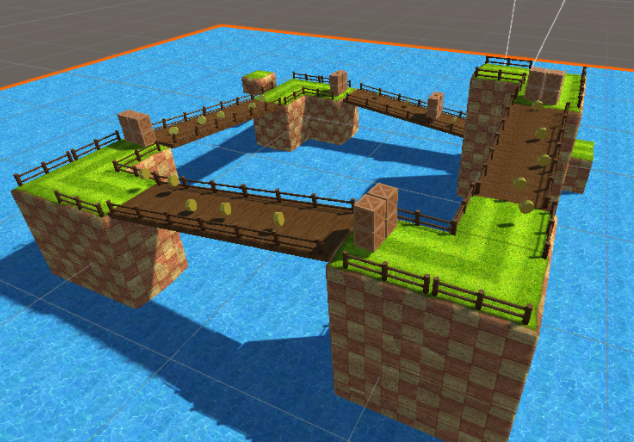
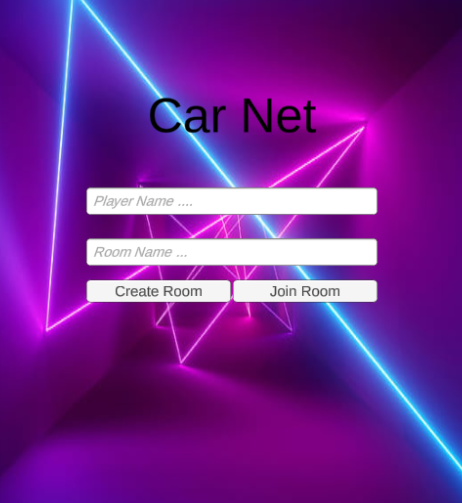
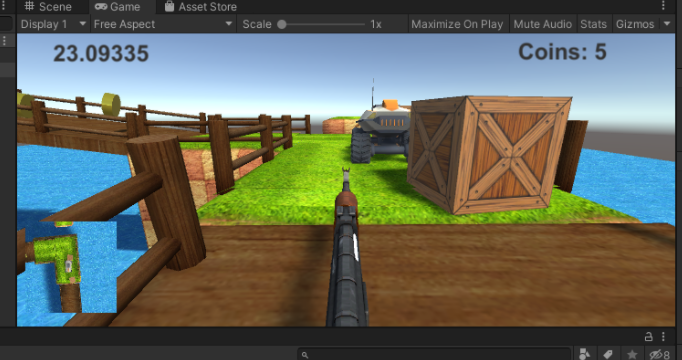

<p align="center">
 
  <h2 align="center">Proyecto Final: Interacción Humano-Computador</h2>  
  <p align="center"> Julio Ticona Quispe, Joel Challco Ttito </p>
  <p align="center">julio.ticona@ucsp.edu.pe, joel.challco@ucsp.edu.pe </p>
  <p align="center">Ciencia de la Computación </p>
  <p align="center">Universidad Catolica San Pablo </p>  
</p>
  
<p>
</a>

En el trabajo final del curso de interacción humano computador se aplicaron nuevos desafíos sobre el proyecto presentado en el examen parcial. La idea inicial se basaba en un modelo de carreras que permitía interactuar en un ambiente de realidad aumentada. 
 
Los nuevos desafíos nos llevaron a pensar en un ambiente multi- jugador y colaborativo. Donde múltiples jugadores a los que llamaremos competidores tendrán que luchar por llegar a una meta, con la ayuda de un segundo jugador al que llamaremos colaborador. Este colaborador tendría como función principal facilitar el camino al competidor de su equipo: este contará con una arma que le permitirá destruir los obstáculos y así poder limpiar el camino, en un ambiente lleno de obstáculos y recompensas, con la única finalidad de llegar en el menor tiempo posible.


</p>


# Features

- [Unity 3D](#unity-3d)
- [Vuforia](#Vuforia)
- [Conexión & Photon2](#Interface-de-usuarios)
- [Multiplayer Colaborativo](#Modo-colaborativo)
- [Image Target](#top-languages-card)
- [Demo](#video-demo)
- [Bugs-solución](#Bugs-solución) 

# Unity 3D
1. Version 2019.4.26f1
2. Assets
   ```
    Modern Weapons Pack ( https://assetstore.unity.com/packages/3d/props/guns/modern-weapons-pack-14233 )
    
    Grass Road Race ( https://assetstore.unity.com/packages/3d/environments/roadways/grass-road-race-46974)
    
    Project Car - Kaiju ( https://assetstore.unity.com/packages/3d/vehicles/land/project-car-kaiju-32794)
    
    Standard Assets ( https://assetstore.unity.com/packages/essentials/asset-packs/standard-assets-for-unity-2018-4-32351)
    ```
    
    

# Vuforia
1. Image Target


# Interface de usuarios


# Modo colaborativo


# Demo
El video de la demo se encuentra almacenado en nuestro repositorio dentro de la caperta /Demo
# Bugs solución
El proyecto se encuentra listo para ser ejecutado. Sin embargo algunas versiones de unity muestran errores con la importación de los standart asstes. En el siguiente link mostramos como solucionar esos bugs: https://www.youtube.com/watch?v=3B7wOd4VO6A&t=301s

